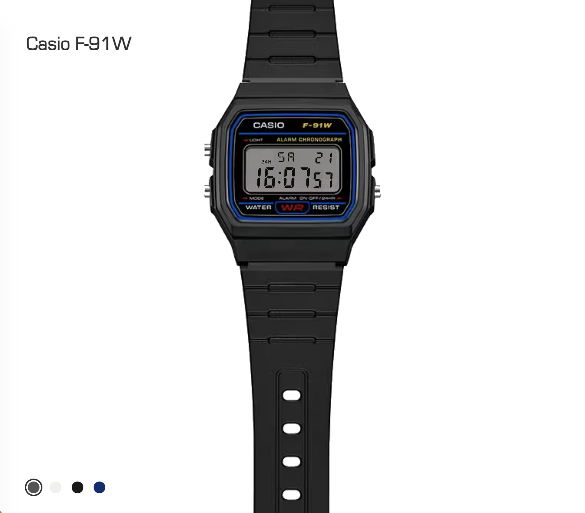

# Casio F-91W Web Replica

A pixel-pushed, browser-based homage to the iconic Casio F-91W.  
Built with HTML/CSS and JavaScript — no frameworks, no build step.

## Live demo

- Demo: https://casio-f91w.snoepfabriek.com/

## Preview



## Features

- Real-time clock with hours, minutes, and seconds
- Date and day-of-week display
- Stopwatch with lap/split functionality
- Daily alarm with hour/minute editing
- Time setting mode (hours, minutes, month, day)
- 12h / 24h time format toggle
- Backlight effect (hold L button)
- Button sound feedback
- Four color variants: Original, White, Black, Blue
- Color preference saved to localStorage
- Responsive layout for mobile and desktop

## Why this exists

I wanted to recreate a physical object in the browser as accurately as possible, focusing on:
- Geometry and proportions
- Materials and subtle shading
- Readable, maintainable CSS (as much as possible)

## Tech stack

- HTML
- CSS
- JavaScript (vanilla)

No frameworks, no build step required. Open `index.html` in a browser to run.

## Project structure

```txt
.
├── index.html              # Main page with inline SVG watch face
├── style.css               # All styling and color variants
├── script/
│   └── CasioF91W.js        # Watch logic (display, OS, button handlers)
├── img/
│   ├── preview.png          # README preview image
│   ├── F-91W-1_05.png       # Original color variant
│   ├── F-91WB-7A_N.png      # White variant
│   ├── F-91WB-1A_N.png      # Black variant
│   └── F-91WB-2A1_N.png     # Blue variant
├── font/
│   └── EuroStyle.ttf        # Display font
├── sound/
│   └── bip.mp3              # Button press sound
├── favicons/
│   └── favicon-32x32.png
└── README.md
```

## Button mapping

| Button | Location    | Action                                                     |
|--------|-------------|------------------------------------------------------------|
| L      | Top-left    | Backlight (hold), context action in alarm/stopwatch/set    |
| C      | Bottom-left | Cycle modes: Time → Alarm → Stopwatch → Set → Time        |
| A      | Right       | Toggle 12/24h (time mode), start/stop (stopwatch), adjust  |

## Credits

- [casio-f91w-fsm](https://github.com/dundalek/casio-f91w-fsm) by Jakub Dundalek — an interactive statecharts-based model of the Casio F-91W built with XState, which builds on this project's rendering code and replaces the logic with a formal state machine
